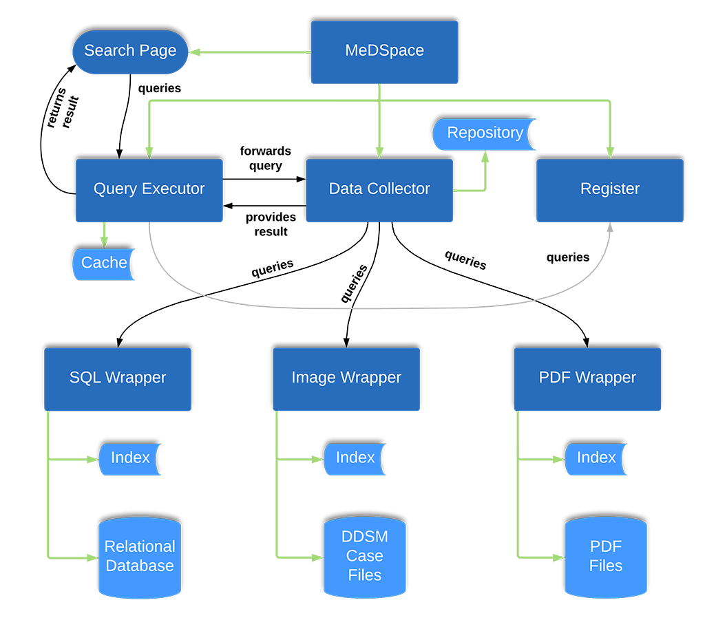
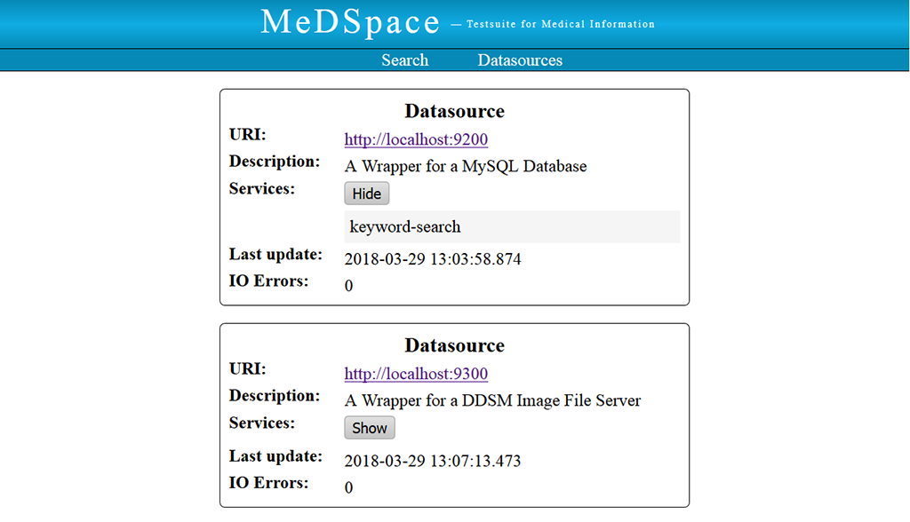

This is the repository for my bachelor thesis 'Implementation of a distributed environment for medical datasources'.

In the thesis I implemented MeDSpace (abbr. for Medical Dataspace) which provides keyword functionality over a set of 
heterogeneous (medical) datasources.

This image shows an ovierview of the project's modules:

The following images show the user interface of MeDSpace:

